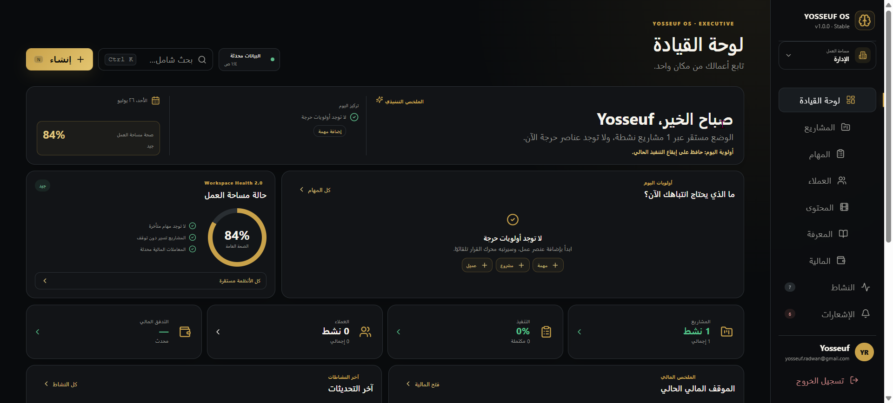

# BASOUL

Current beta baseline: **BASOUL Beta 1 · v4.0.0-rc.1 · Platform Foundation**


**A unified, organization-aware business platform founded by YOSSEUF RADWAN.**

BASOUL is the technology masterbrand. YOSSEUF RADWAN remains the founder and personal identity. First-party copyright is held by **ELSHENAWY RADWAN**.

BASOUL OS unifies projects, tasks, clients, content, knowledge, finance, activity, notifications, administration, and executive decision support inside one governed workspace.

> **What should I do now?**



## Current beta status

- Product package: `basoul-platform`
- Product version: `v4.0.0-rc.1`
- Release channel: **Beta**
- Web identity: approved BASOUL Symbol + Wordmark
- Visual palette: Navy / Electric Blue / Cyan / Violet
- Development authentication: Email + Password
- RTL and responsive surfaces: enabled
- Production identifiers and Supabase Production: unchanged

The evidence-backed Beta 1 verification record is maintained at `docs/releases/BASOUL_BETA_1_RUNTIME_VERIFICATION_2026-08-10.md`.

## Core capabilities

- Executive Dashboard and Workspace Health
- Projects and task execution
- Client management
- Content Studio
- Knowledge base
- Finance overview
- Unified Activity Feed
- Notification Center
- Global Search and Universal Quick Create
- Administration and permission-aware operations
- Secure member invitations
- Keyboard-first workflows
- Shared intelligence architecture for BASOUL AI integration

## Architecture

```text
YVL canonical mechanics
+ BASOUL Brand Foundation
→ BASOUL semantic adapter
→ Web / React Native primitives
→ BASOUL products
```

At the application level:

```text
Presentation
    ↓
Decision Layer
    ↓
Business Logic
    ↓
Data Services / Supabase
```

YVL governs mechanics such as spacing, radii, motion, accessibility, RTL, and interaction geometry. BASOUL Brand Foundation governs identity, approved assets, colors, and visual authority.

## Technology

- Next.js
- React
- TypeScript
- Supabase
- GitHub Actions
- Vercel
- Expo / React Native
- Node.js

## Quick start

```bash
cp .env.example .env.local
npm install
npm run dev
```

Configure:

```env
NEXT_PUBLIC_SUPABASE_URL=your-project-url
NEXT_PUBLIC_SUPABASE_ANON_KEY=your-anon-key
```

Open `http://localhost:3000`.

## Quality gate

```bash
npm run quality
```

Security and quality gates must not be weakened to make a beta appear green. Known dependency advisories are tracked explicitly until a supported fix is verified.

## Documentation

- [Installation](INSTALL.md)
- [Deployment](DEPLOYMENT.md)
- [Security](SECURITY.md)
- [Contributing](CONTRIBUTING.md)
- [BASOUL Brand Foundation](brand/basoul/README.md)
- [Beta 1 runtime verification](docs/releases/BASOUL_BETA_1_RUNTIME_VERIFICATION_2026-08-10.md)
- [Ecosystem Pass C](docs/architecture/BASOUL_ECOSYSTEM_PASS_C_2026-08-10.md)
- [Workspace architecture](docs/WORKSPACE_ARCHITECTURE.md)
- [Product principles](docs/PRODUCT_PRINCIPLES.md)
- [AI roadmap](docs/AI_ROADMAP.md)

Historical release notes remain in the repository as evidence and are not rewritten as current product identity.

## License

Released under the [MIT License](LICENSE).

---

**BASOUL OS** · Founded by **YOSSEUF RADWAN** · Copyright © 2026 **ELSHENAWY RADWAN**